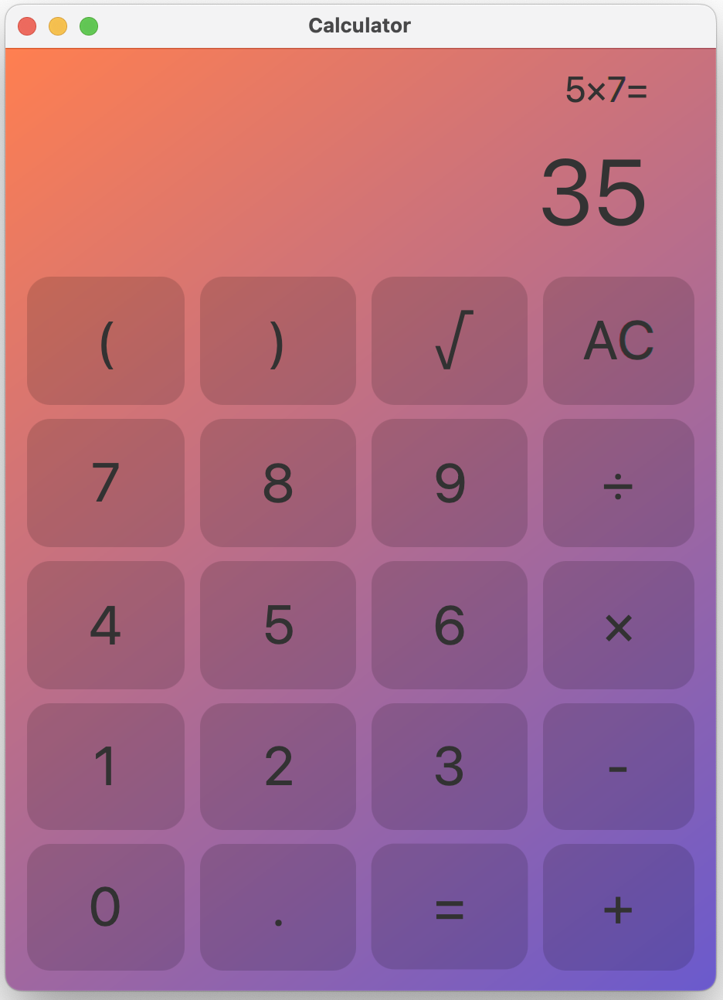
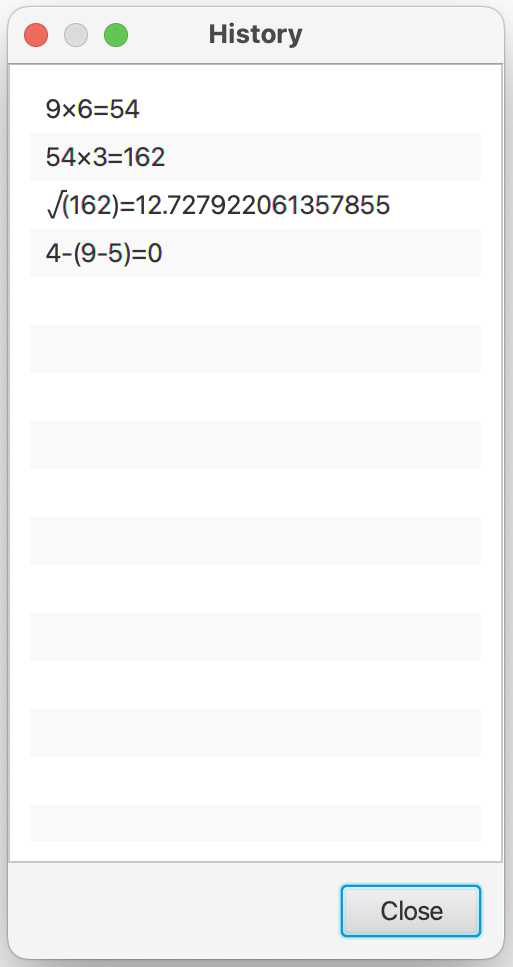

# Calculator-JavaFX
* [Background](#background)
* [Introduction](#introduction)
* [References](#references)

## <span id="background">Background</span>
该项目为算法与数据结构的课程设计。通过```栈```将中缀表达式转换为后缀表达式进行计算。

## <span id="introduction">Introduction</span>
使用Java语言编写，图形界面由[JavaFX](https://openjfx.io/)构建。


<br>


功能：
* 四则运算、括号、小数点、平方根
* 支持键盘输入
* 历史记录（按H键）

## <span id="references">References</span>
* [JavaFX](https://openjfx.io/)
* [Scene Builder](https://gluonhq.com/products/scene-builder/)